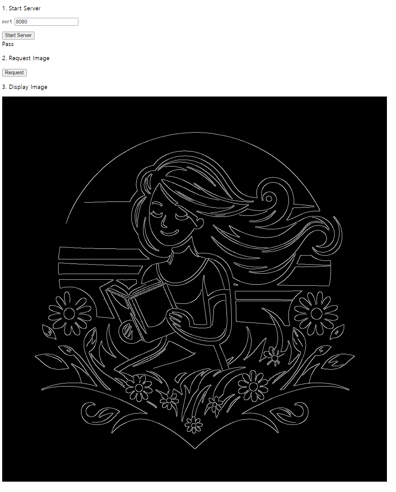

== display_image_opencv

This sample application is designed to test an OpenCV algorithm applied to a JPEG image. As it is built upon another sample application called 'display_image', it allows testing of the Hanwha Vision Open Platform's Network Manager. By using the Network Manager, an image processed with the OpenCV Canny algorithm can be displayed on the application's web page. For more details, refer to *3.1 Network Manager*
 in *Hanwha_Vision_OpenPlatform_24.00.01_SDK_API*.

Related events are as follows: +

*Sendable Events*

[cols=",,",options="header",]
|===
|Event type |Header file |Event type (enum)
|Start Service |i_app_network_manager.h
|IAppNetworkManager::EEventType::eStartService

|Stop Service |i_app_network_manager.h
|IAppNetworkManager::EEventType::eStopService

|Send Data |i_app_network_manager.h
|IAppNetworkManager::EEventType::eSendData

|Close Client |i_app_network_manager.h
|IAppNetworkManager::EEventType::eCloseClient
|===

*Receivable Events*

[cols=",,",options="header",]
|===
|Event type |Header file |Event type (enum)
|New Client Connected |i_app_network_manager.h
|IAppNetworkManager::EEventType::eNewClientConnected

|Client Disconnected |i_app_network_manager.h
|IAppNetworkManager::EEventType::eClientDisconnected

|Client Data |i_app_network_manager.h
|IAppNetworkManager::EEventType::eClientData

|Server Data |i_app_network_manager.h
|IAppNetworkManager::EEventType::eServerData
|===

=== Prerequisites

* Hanwha Vision Open Platform 23.00.00 or higher

=== Scenario

* Preconditions
[arabic]
. Open the camera web viewer, go to [Setup]>[Open Platform], and click
[Install] to install the application.
. Click [Start] to start the application.
* Test
[arabic]
. In the [Open Platform] menu of the web viewer, click [Go App].
. Enter port number in checkbox and click [Start Server] on the
application web page.
. Click [Request] on the application web page.

=== Result

* A "Pass" message will appear below the [Start Server] button.
* An image will be displayed under [3. Display Image].

=== Building Application (cv5)

[arabic]

. Download and cross compile OpenCV source code.
+
....
opencv$ mkdir build
opencv$ cd build
opencv/build$ cmake -DCMAKE_TOOLCHAIN_FILE=../platforms/linux/aarch64-gnu.toolchain.cmake ..
opencv/build$ make install
....
. Copy libraries and headers. Let's say path of opencv on step 1 above is [opencv]
+
....
display_image_opencv/app/libs$ cp -a [opencv]/build/install/lib/* .
display_image_opencv/app/libs$ cd ../includes
display_image_opencv/app/includes$ cp -a [opencv]/build/install/include/* .
....
. Build application.
+
....
$ APP_NAME=display_image_opencv SDK_VER=24.06.14(your SDK version) SOC=[cv5, orinnx8g_jp512] docker compose up
$ docker compose down --remove-orphans
....
. Check the build results in current directory. If successful, you will be able to find the cap file.
