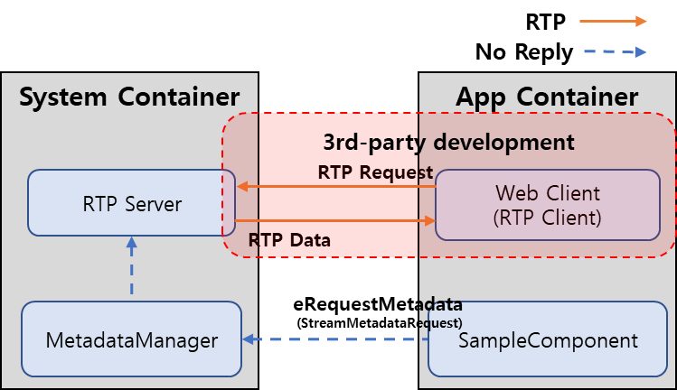
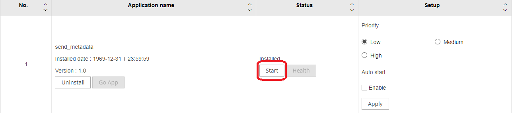
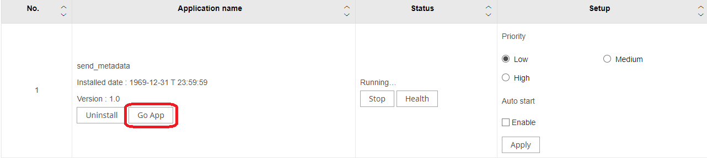
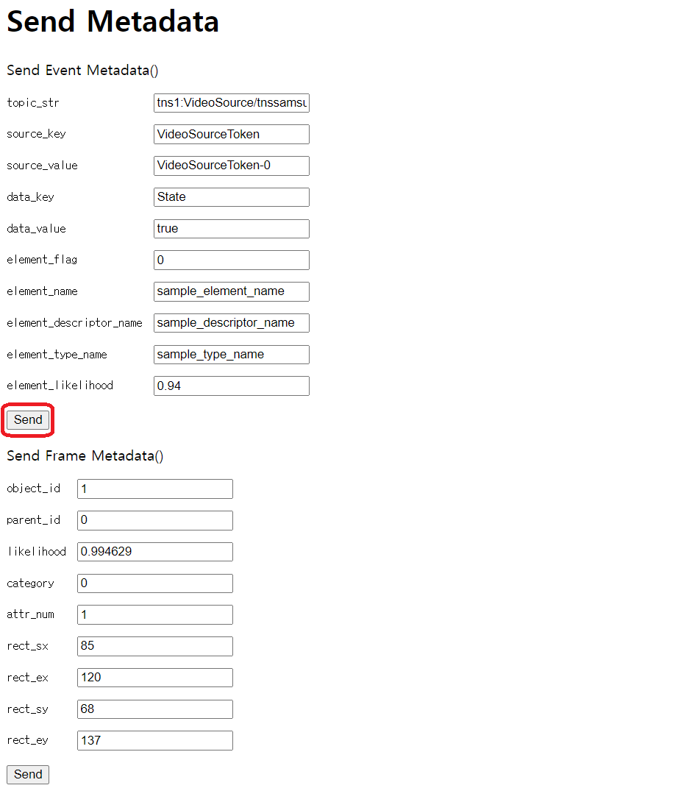
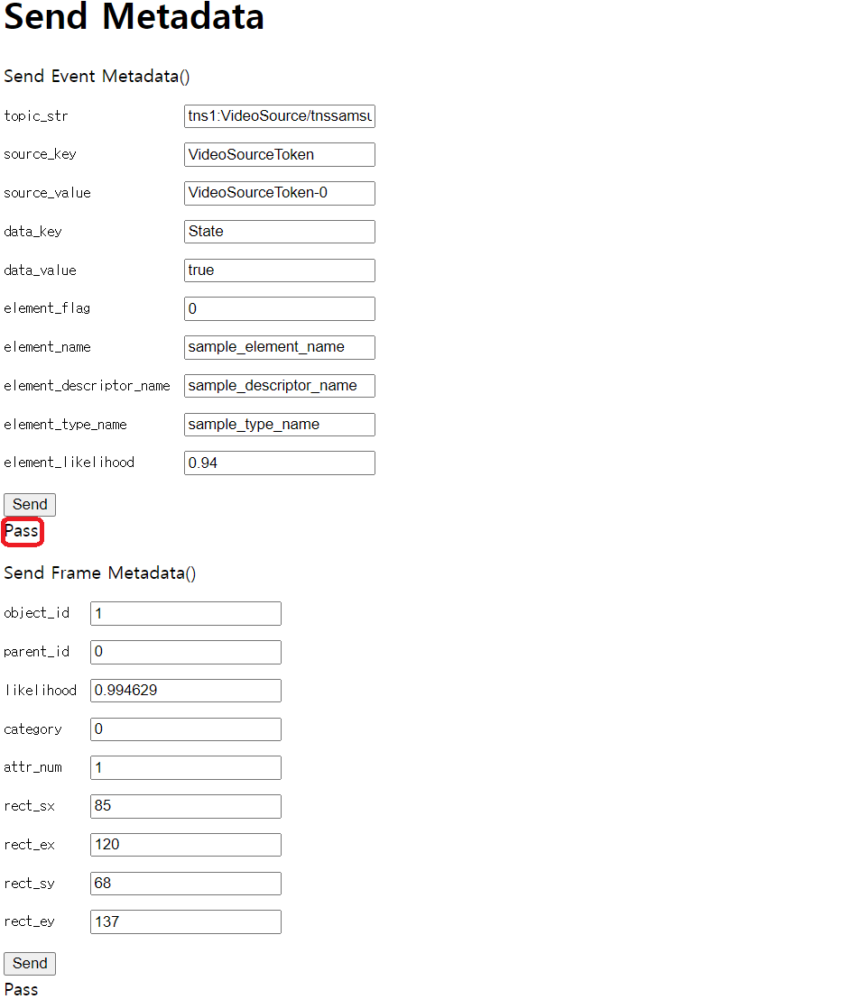
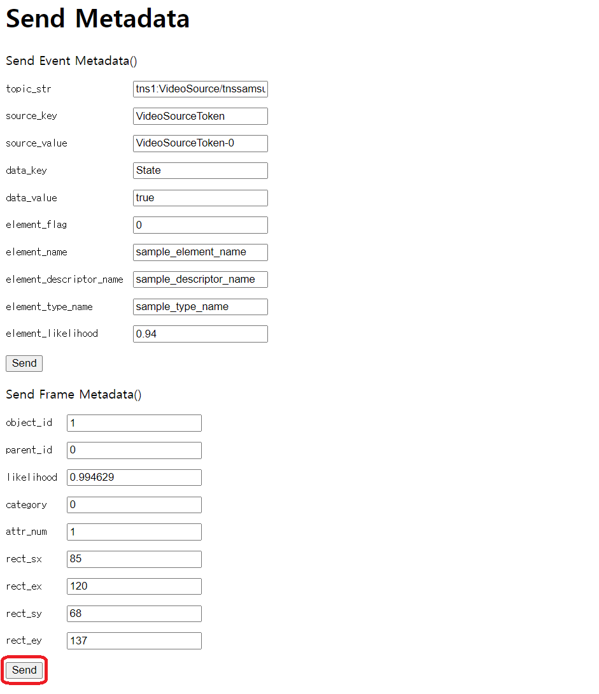
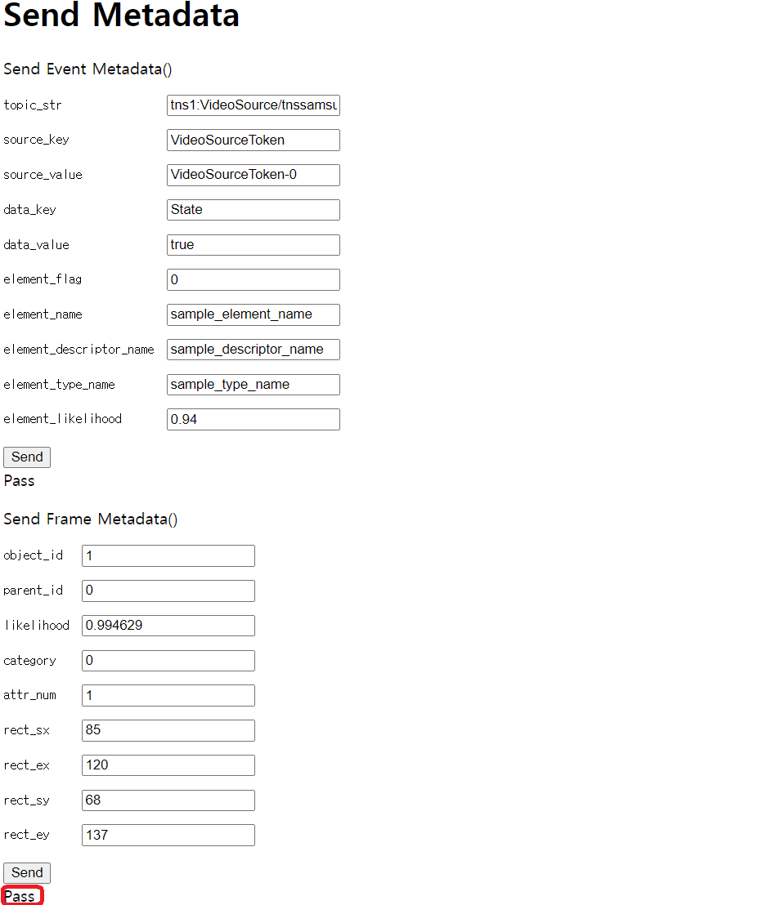

== send_metadata

This sample application is designed to test the send-metadata-event.

=== Overview: Event Flow

The application can send the [Event metadata] and [Frame metadata]
events to the camera. [Event metadata] is generated when an event
occurs, which contains information about the topic, timestamp, source,
data, etc. [Frame metadata] is generated when every frame of video data
is generated, which contains information about the resolution,
timestamp, object, etc.
 

* Possible Scenario:  
+
Sending an event and subsequently requesting and
receiving metadata via the Real-time Transport Protocol (RTP) is a possible scenario.

=== Data Types for Event

* *Common Parameters*
** StreamMetadata 
+
[options="header"]
|===
|Function|Return|Parameter|Description

|set_frame_metadata|void|EventMetadataItem&&
event_metadata|Set frame_metadata
|frame_metadata|FrameMetadataItem&|-|Returns frame_metadata
|set_ptz_metadata|void|PtzMetadataItem& ptz_metadata|Set ptz_metadata.
|ptz_metadata|PtzMetadataItem&|-|Returns ptz_metadata
|set_event_metadata|void|vector& event_metadata|Set event_metadata
|add_event_metadata|void|EventMetadataItem&& event_metadata|Add
event_metadata 
|event_metadata|vector&|-|Returns event_metadata
|NeedBroadcasting|void|bool broadcast|Set broadcast
|SetSyncInfo|void|uint64_t profile_id, uint64_t session_id|Set Sync
information. 
|SetSessionID|void|uint64_t session_id|Set session_id
|GetSessionID|uint64_t|-|Returns session_id 
|SetProfileID|void|uint64_t
profile_id|Set profile_id 
|GetProfileID|uint64_t|-|Returns profile_id
|HasFrame|bool|-|Returns whether frame_metadata is present or not
|HasPtz|bool|-|Returns whether ptz_metadata is present or not
|HasEvent|bool|-|Returns whether event_metadata is present or not
|IsBroadcastable|bool|-|Check whether it is Broadcastable
|IsSyncable|bool|-|Check whether it is Syncable
|===

* *Event Metadata Parameters*
** EventMetadataItem 
+
[options="header"]
|===
|Function|Return|Parameter|Description

|set_timestamp|void|uint64_t timestamp|Set TimeStamp
|timestamp|uint64_t|-|Returns TimeStamp 
|set_topic|void|string&&
topic|Set Tocic 
|topic|string&|-|Returns topic
|set_property|void|string&& property|Set property
|property|string&|-|Returns property 
|add_source|void|SimpleItem&&
source|Add source 
|source|vector&|-|Returns source
|add_key|void|SimpleItem&& key|Add key 
|key|vector&|-|Returns key
|add_data|void|SimpleItem&& data|Add data 
|data|vector&|-|Returns data
|add_element|void|ElementItem&& element|Add element
|element|vector&|-|Returns element
|===

** SimpleItem 
+
[options="header"]
|===
|Variable|Type|Description 

|name|string|Simple item's key 
|value|string|Simple item's Value
|===

** ElementItem 
+
[options="header"]
|===
|Variable|Type|Description 

|element_name|string|Element's name
|descriptor_name|string|Descriptor's name 
|element_data|string|Element
data 
|candidate|vector|candidate's struct
|===

** Candidate 
+
[options="header"]
|===
|Variable|Type|Description 

|type_name|string|Candidate's Name 
|likelihood|float|Candidate's
likelihood
|===

* *Frame Metadata Parameters*
** FrameMetadataItem 
+
[options="header"]
|===
|Function|Return|Parameter|Description

|set_timestamp|void|uint64_t timestamp|Set TimeStamp
|timestamp|uint64_t|-|Returns TimeStamp 
|set_resolution|void|int width,
int height|Set width and height 
|width|int|-|Returns width
|height|int|-|Returns height 
|set_media_source_token|void|string&
token|Set media_source_token 
|media_source_token|string&|-|Returns
media_source_token 
|set_video_source_token|void|string& token|Set
video_source_token 
|video_source_token|string&|-|Returns
video_source_token 
|set_geolocation|void|bool enable, float lon, float
elevation|Set geolocation
|geolocation|metadata::common::Geolocation&|-|Returns geolocation
|add_object|void|metadata::common::Object&& object|Add object
|object|vectormetadata::common::Object&|-|Returns object
|===

** Object  
+
[options="header"]
|===
|Variable|Type|Description 

|rule_id|uint32_t|rule id info 
|object_id|uint32_t|object id info
|type|MetadataType|type info 
|category|ObjectCategory|Category info(0 ~ 14)
|rect|Rect|Rect info 
|likelihood|float|likelihood info
|parent_id|uint32_t|parent id info 
|attr_flag|uint32_t|attribute flag
info 
|attr_num|uint32_t|attribute number info
|attr_class|uint64_t|attribute class info 
|timestamp|uint64_t|TimeStamp
info 
|crop_img_info|Rect|crop image info
|proximate_obj_id|uint32_t|proximate object id info
|proximate_distance|float|proximate distance info
|image_ref|string|image reference info
|===

** Rect 
+
[options="header"]
|===
|Variable|Type|Description 

|sx|int32_t|Starting
point of x 
|sy|int32_t|Starting point of y 
|ex|int32_t|Ending point of
x 
|ey|int32_t|Ending point of y
|===

=== Setting EventMetadata

* Create EventMetadataItem.
+
[source,cpp]
----
auto event_metadata = EventMetadataItem();
----
* Set the topic and timestamp of EventMetadataItem.
+
[source,cpp]
----
event_metadata.set_topic("tns1:VideoSource/tnssamsung:" + <App Name>);
event_metadata.set_timestamp(timestamp);
----
* Add the source and data of EventMetadataItem.
+
[source,cpp]
----
event_metadata.add_source({"VideoSourceToken", "VideoSourceToken-0"});
event_metadata.add_data({"State", "true"});
----
* You can add ElementItem to EventMetadataItem.To add ElementItem, set
it as follows.
** Set element_name and descriptor_name of ElementItem.
+
[source,cpp]
----
EventMetadataItem::ElementItem element_item;
element_item.element_name = "sample_element_name";
element_item.descriptor_name = "sample_descriptor_name";
----
** Set type_name and likelihood of Candidate.
+
[source,cpp]
----
EventMetadataItem::Candidate candidate;
candidate.type_name = "sample_type_name";
candidate.likelihood = 0.94;
----
** Add Candidate to ElementItem.
+
[source,cpp]
----
element_item.candidate.push_back(candidate);
----
** Add ElementItem to EventMetadataItem.
+
[source,cpp]
----
event_metadata.add_element(std::move(element_item));
----
* Create StreamMetadata using Channel and Timestamp.
+
[source,cpp]
----
auto metadata = StreamMetadata(channel, timestamp);
----
* Add EventMetadataItem to StreamMetadata.
+
[source,cpp]
----
metadata.add_event_metadata(std::move(event_metadata));
----
* Set Broadcasting in StreamMetadata.
+
[source,cpp]
----
metadata.NeedBroadcasting(true);
----

=== Setting FrameMetadata

* Create a FrameMetadataItem.
+
[source,cpp]
----
auto frame_metadata = FrameMetadataItem();
----
* Set the resolution and timeStamp of FrameMetadataItem.
+
[source,cpp]
----
frame_metadata.set_resolution(3840, 2160);
frame_metadata.set_timestamp(timestamp);
----
* Set the data of the object.
+
[source,cpp]
----
metadata::common::Object send_object;
send_object.object_id = 2;
send_object.parent_id = 0;
send_object.timestamp = timestamp;
send_object.likelihood = (float)0.994629;
send_object.category = (metadata::common::ObjectCategory)0;
send_object.attr_num = 0;
----
* Set the Rect information of the object.
+
[source,cpp]
----
send_object.rect.sx = 85; // Starting point of x.
send_object.rect.ex = 120; // Ending point of x.
send_object.rect.sy = 68;   // Starting point of  y
send_object.rect.ey = 137;  // Ending point of y
----
* Create StreamMetadata using Channel, Timestamp, and MetadataType.
+
[source,cpp]
----
auto metadata = StreamMetadata(GetChannel(), timestamp, Metadata::MetadataType::kAI);
----
* Set FrameMetadataItem to StreamMetadata.
+
[source,cpp]
----
metadata.set_frame_metadata(std::move(frame_metadata));
----

=== Sending StreamMetadata

* Set StreamMetadata to the builder.
+
[source,cpp]
----
auto builder = IPMetadataManager::StreamMetadataRequest::builder();
builder.set_stream_metadata(std::forward<class StreamMetadata>(metadata));
----
* Set builder to StreamMetadataRequest.
* Include StreamMetadataRequest in the event and send it to
"MetadataManager".
+
[source,cpp]
----
auto metadata_request = reinterpret_cast<IPMetadataManager::StreamMetadataRequest*>(builder.build());
SendNoReplyEvent("MetadataManager", static_cast<int32_t>(IMetadataManager::EEventType::eRequestMetadata), 0, metadata_request);
----

=== Sending Metadata

* Click [Start] on the web page. +
 
+
* Once the application is running, click [Go App]. +
 
+
* To send Event Metadata, click [Send] below [Send Event Metadata()]. +
 
 
+
* To send Frame Metadata, click [Send] below [Send Frame Metadata()]. +
 
 

=== xml from metadata

When an RTP Session is established and you click [Send], Event metadata
as shown below is sent to RTP Meta Track.

* Event Meta
+
[source,xml]
----
<?xml version="1.0" encoding="UTF-8"?><tt:MetadataStream xmlns:tt="http://www.onvif.org/ver10/schema" xmlns:ttr="https://www.onvif.org/ver20/analytics/radiometry" xmlns:wsnt="http://docs.oasis-open.org/wsn/b-2" xmlns:tns1="http://www.onvif.org/ver10/topics" xmlns:tnssamsung="http://www.samsungcctv.com/2011/event/topics"><tt:Event><wsnt:NotificationMessage><wsnt:Topic Dialect="http://www.onvif.org/ver10/tev/topicExpression/ConcreteSet">tns1:VideoSource/tnssamsung:send_metadata</wsnt:Topic><wsnt:Message><tt:Message UtcTime="2000-01-25T02:24:20.613Z"><tt:Source><tt:SimpleItem Name="VideoSourceToken" Value="VideoSourceToken-0"/></tt:Source><tt:Key></tt:Key><tt:Data><tt:SimpleItem Name="State" Value="true"/></tt:Data></tt:Message></wsnt:Message></wsnt:NotificationMessage></tt:Event></tt:MetadataStream>
----

When an RTP Session is established and you click [Send], Frame metadata
as shown below is sent to RTP Meta Track.

* Frame Meta
+
[source,xml]
----
<?xml version="1.0" encoding="UTF-8"?><tt:MetadataStream xmlns:tt="http://www.onvif.org/ver10/schema" xmlns:ttr="https://www.onvif.org/ver20/analytics/radiometry" xmlns:wsnt="http://docs.oasis-open.org/wsn/b-2" xmlns:tns1="http://www.onvif.org/ver10/topics" xmlns:tnssamsung="http://www.samsungcctv.com/2011/event/topics" xmlns:fc="http://www.onvif.org/ver20/analytics/humanface" xmlns:bd="http://www.onvif.org/ver20/analytics/humanbody"><tt:VideoAnalytics><tt:Frame UtcTime="2000-01-25T03:37:54.473Z"><tt:Transformation><tt:Translate x="-1.0" y="1.0"/><tt:Scale x="0.000521" y="-0.000926"/></tt:Transformation><tt:Object ObjectId="2"><tt:Appearance><tt:Shape><tt:BoundingBox left="1685.0" top="68.0" right="1920.0" bottom="374.0"/><tt:CenterOfGravity x="1802.5" y="221.0"/></tt:Shape><tt:Class><tt:ClassCandidate><tt:Type>Other</tt:Type><tt:Likelihood>0.99</tt:Likelihood></tt:ClassCandidate><tt:Type Likelihood="0.99">Unknown</tt:Type></tt:Class></tt:Appearance></tt:Object></tt:Frame></tt:VideoAnalytics></tt:MetadataStream>
----

=== Building Application

[arabic]
. Build application.
+
....
$ APP_NAME=send_metadata SDK_VER=24.06.14(your SDK version) SOC=[cv5, orinnx8g_jp512] docker compose up
$ docker compose down --remove-orphans
....
. Check the build results in current directory. If successful, you will be able to find the cap file.
